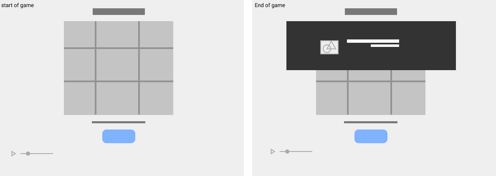
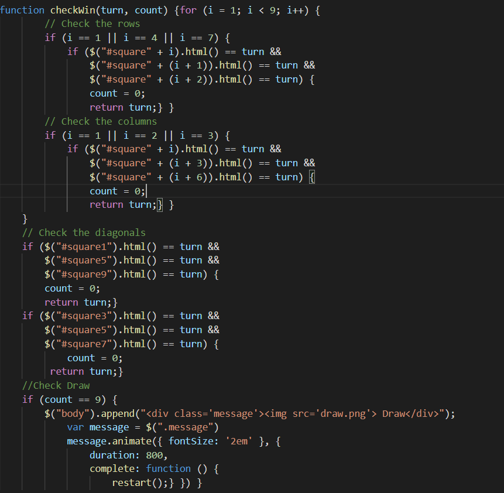

# Tic Tac Toe Game
 
<h1><a href='https://pages.git.generalassemb.ly/shahadalbaidhani/tic-tac/'> Tic Tac Toe demo </a></h2>
<h2>List of technologies used in this project:</h2>
 
<ul>
    <li>HTML5</li>
      <li>CSS3</li>
    <li>Java Script</li>
    <li>Jquery</li>
    <li>Visual Studio Code</li>
      <li>Figma Wireframes</li>

</ul>
<h2>wireframe</h2>

<h2>User Stories:</h2>
  
<ul>
<li>As a player, I want to play with my friends or family, so that I can play with another player.</li>
<li>As a player, I want to see the result, so I can see if I'm going to win or not.</li>
<li>As a player, if I mess up, I can restart the game.</li>
<li>As a player, I want to see the role of play, so I can see my role.</li>
<li>As a player, I want to play in a game with sound effects and music, so that I can enjoy the game.</li>
</ul>

<h2>Planning/Development process and problem-solving strategy:</h2>
 
<ul>
<li>Create New Repository in GitHub Enterprise.</li>
<li>Prepare the Folders and Files for the game.
  <ul>
      <li>create README.md</li>
       <li>create index.html</li>
        <li>create styles.css</li>
        <li>create main.js</li>
        <li>create  wireframe </li>
         <li>Add images</li>
</ul>
</li>
<li>work on the Design of index.html as the main page of the game.</li>
<li>work on main.js file to build the logic of the game.</li>
<li>Add sound effects to background.</li> </ul>
<h2>Unsolved Problems :</h2>
 
nothing

<h2>How to become a winner:</h2>
 
<ul>
<li>One of the rows has the same value so you win.</li>
<li>One of the columns has the same value so you win.</li>
<li>One of the diagonals has the same value so you win.</li>
</ul>
<h2>My favorite functions:</h2>

It Checks for a win or a draw ,it's my favorite because it's short and simple

